# Central do Campeonato

Sistema web desenvolvido para auxiliar na organização de campeonatos de futebol.

O projeto permite cadastrar campeonatos, times, jogadores, estádios, partidas e gols. Também é possível inscrever times nos campeonatos, montar os elencos, registrar os gols, finalizar as partidas e consultar a classificação e a artilharia.

O sistema possui cadastro de usuários, tela de login e controle de acesso às páginas internas.

---

## Tecnologias utilizadas

O projeto foi desenvolvido com:

- Node.js;
- Express;
- EJS;
- PostgreSQL;
- HTML;
- CSS;
- JavaScript;

Os comandos de cadastro, alteração e consulta dos dados foram escritos diretamente em SQL, e podem ser acessados na pasta **sql**.

---

## Diagrama conceitual do banco de dados

O diagrama apresenta as tabelas utilizadas no sistema e os relacionamentos existentes entre elas.

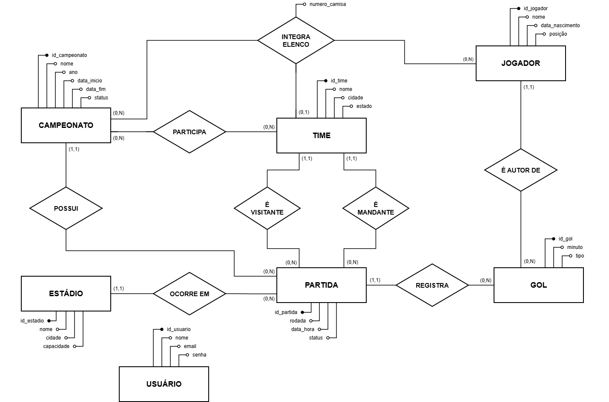

---

## Como executar o projeto

### 1. Instalar os programas necessários

Para executar o projeto, é necessário ter instalado:

- Node.js;
- npm;
- PostgreSQL;
- pgAdmin;
- Git, caso o projeto seja baixado pelo GitHub.

Para conferir se o Node.js está instalado, execute:

```bash
node --version
```

Para conferir o npm:

```bash
npm --version
```

---

### 2. Instalar as dependências

Abra o terminal dentro da pasta do projeto e execute:

```bash
npm install
```

---

### 3. Criar o banco de dados

Abra o pgAdmin e conecte-se ao PostgreSQL.

Crie um banco de dados com o nome:

```text
futgestor
```

O banco também pode ser criado pelo Query Tool com o comando:

```sql
CREATE DATABASE futgestor;
```

Depois de criar o banco, selecione o banco `futgestor` antes de executar os arquivos SQL.

---

### 4. Executar os arquivos SQL

Os arquivos estão dentro da pasta:

```text
sql/
```

Na primeira execução, utilize esta ordem:

```text
01_criacao.sql
02_povoamento.sql
```

O arquivo `01_criacao.sql` cria as tabelas, as chaves, as restrições e as views que calculam os placares.

O arquivo `02_povoamento.sql` adiciona dados para testes e demonstração do sistema.

O arquivo `03_consultas.sql` possui consultas que podem ser executadas separadamente para testar os dados.

O arquivo `00_limpeza.sql` deve ser utilizado somente quando for necessário apagar as tabelas e reconstruir o banco.

---

### 5. Configurar o arquivo `.env`

Na pasta principal do projeto, localize o arquivo:

```text
.env.example
```

Crie uma cópia desse arquivo e altere o nome da cópia para:

```text
.env
```

O conteúdo deverá seguir este modelo:

```env
DB_HOST=localhost
DB_PORT=5432
DB_USER=postgres
DB_PASSWORD=SUA_SENHA
DB_NAME=futgestor
PORT=3000
SESSION_SECRET=SUA_CHAVE_SECRETA
```

Substitua `SUA_SENHA` pela senha utilizada no PostgreSQL.

Em `SESSION_SECRET`, coloque uma sequência de caracteres para proteger a sessão.

---

### 6. Criar o usuário administrador

Depois de configurar o banco de dados e o arquivo `.env`, execute:

```bash
npm run criar-admin
```

Esse comando criará o usuário administrador inicial.

As credenciais são:

```text
E-mail: admin@sumula.com
Senha: admin123
```

Também é possível criar uma nova conta pela tela de cadastro do sistema.

---

### 7. Iniciar o sistema

Para iniciar normalmente, execute:

```bash
npm start
```

Durante o desenvolvimento, pode ser utilizado:

```bash
npm run dev
```

Depois, abra o navegador e acesse:

```text
http://localhost:3000
```

O sistema abrirá a tela de login.

---

## Principais funcionalidades

O sistema permite:

- criar uma conta;
- realizar login;
- sair do sistema;
- cadastrar campeonatos;
- cadastrar times;
- cadastrar jogadores;
- cadastrar estádios;
- inscrever times nos campeonatos;
- montar os elencos;
- cadastrar partidas;
- registrar gols nas partidas agendadas;
- finalizar partidas pela tela de gols;
- consultar a classificação;
- consultar a artilharia.

---

## Sistema Central do Campeonato

1. Login:

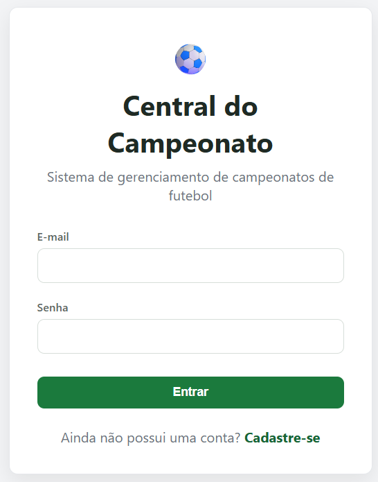

2. Tela inicial:

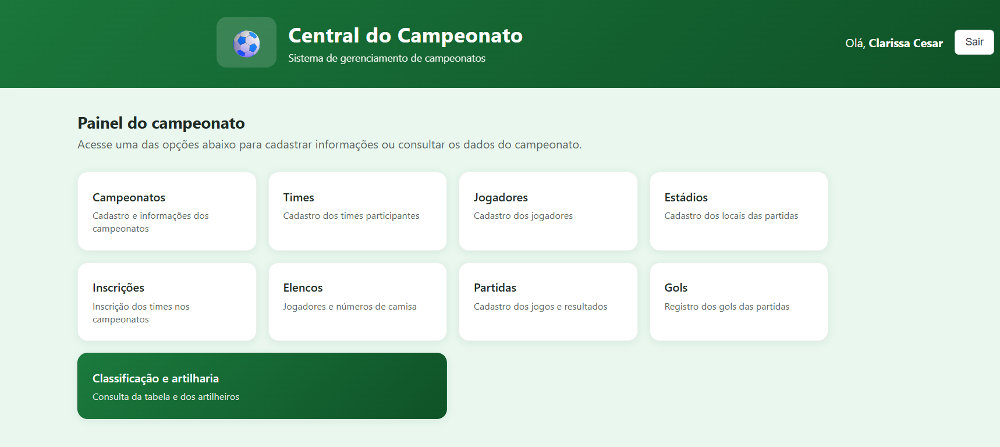

3. Campeonatos:

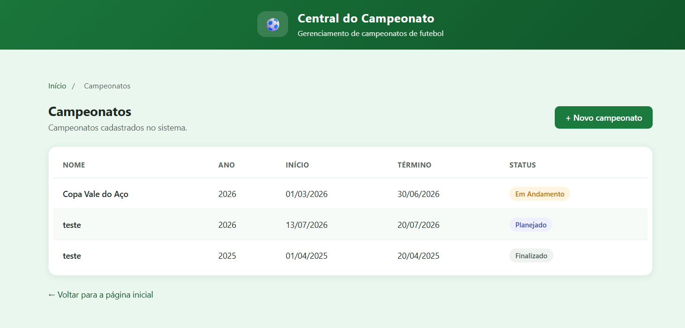

4. Times:

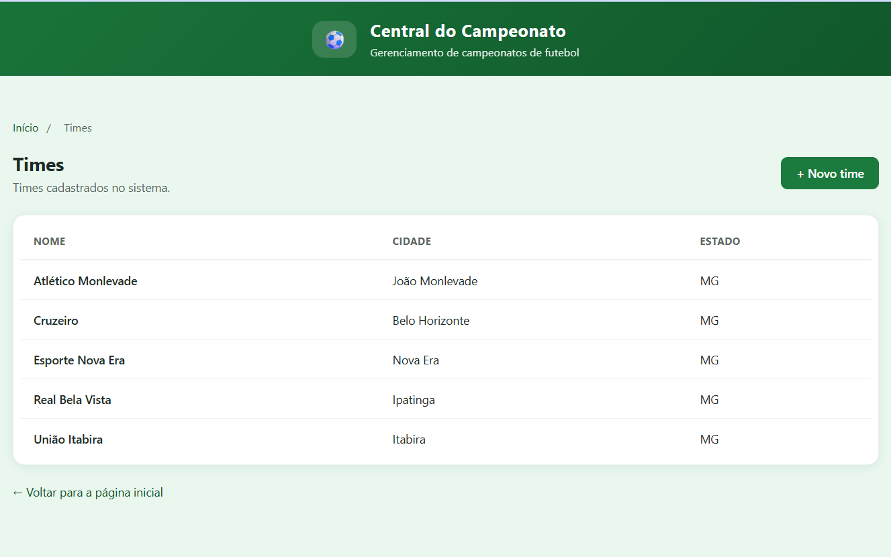

5. Jogadores:

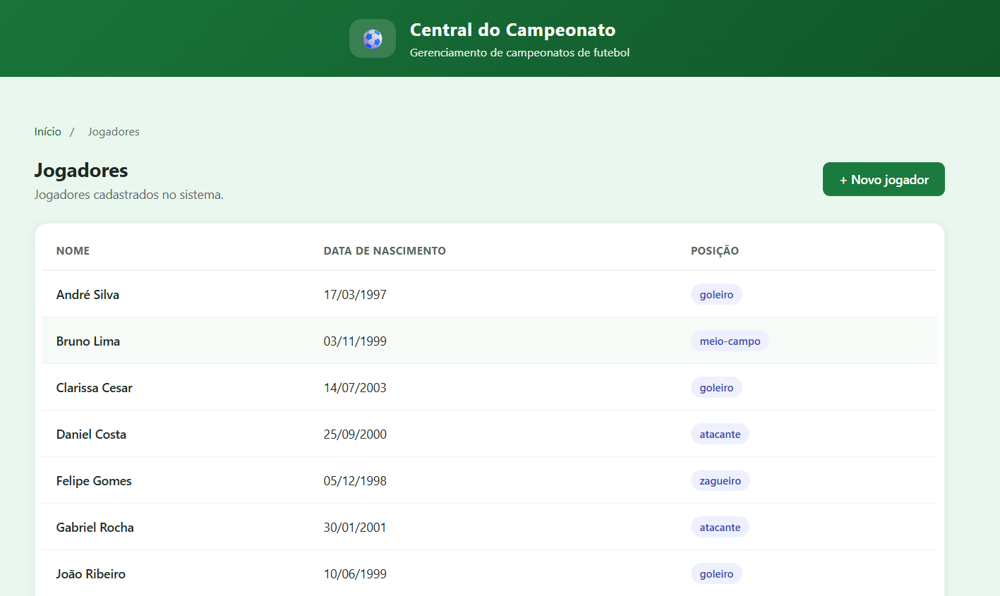

6. Estádios:

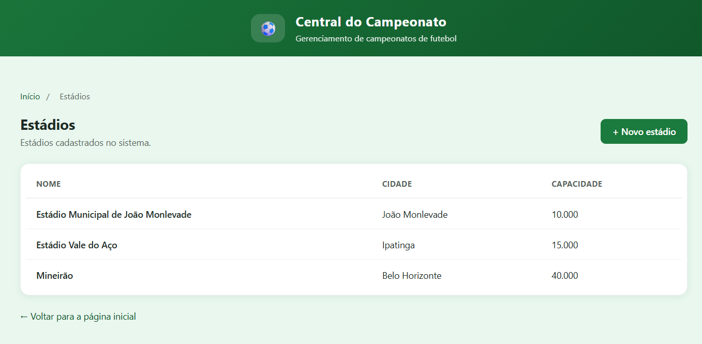

7. Inscrições:

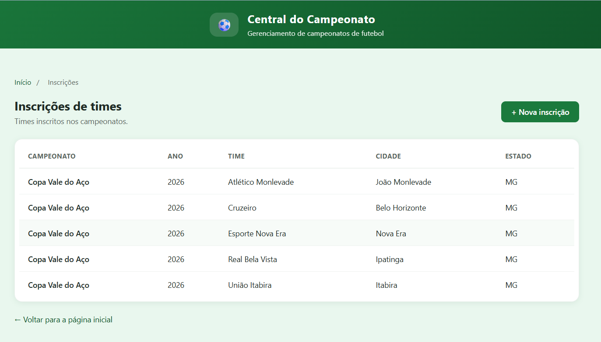

8. Elencos:

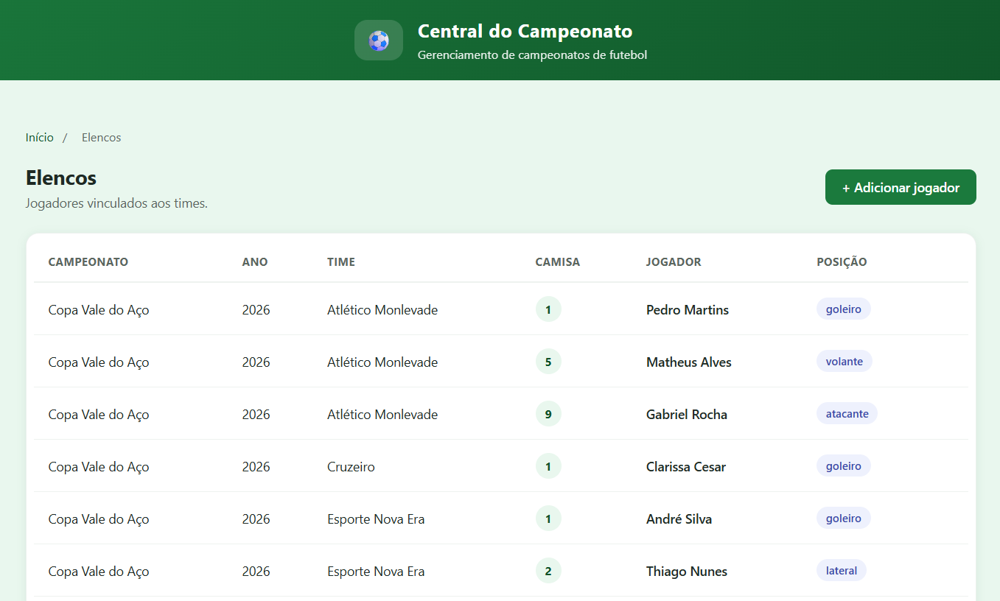

9. Partidas:

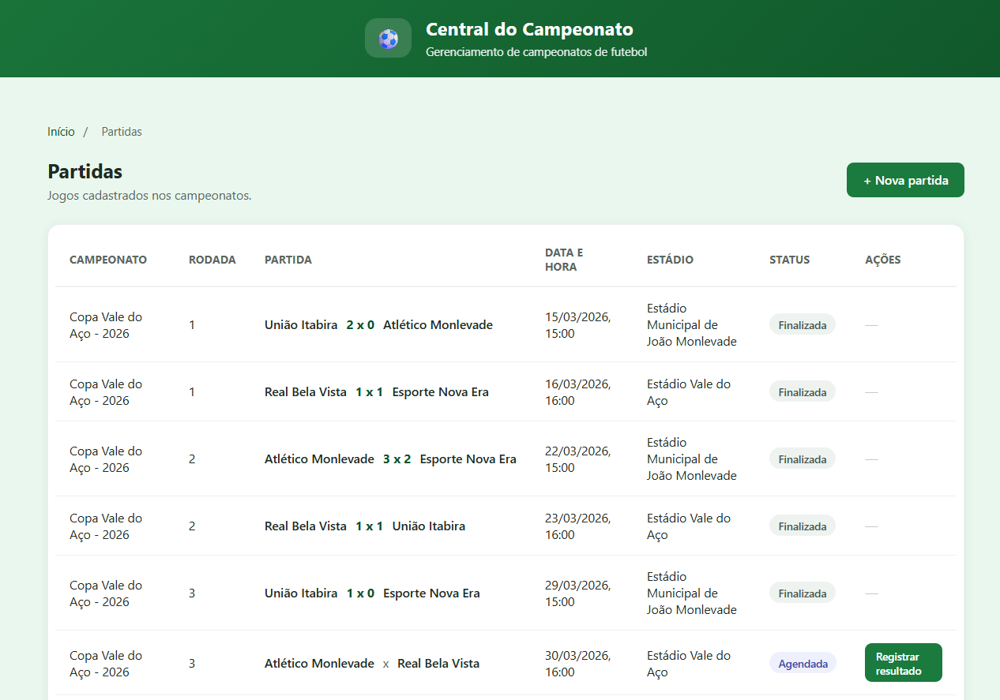

10. Gols:

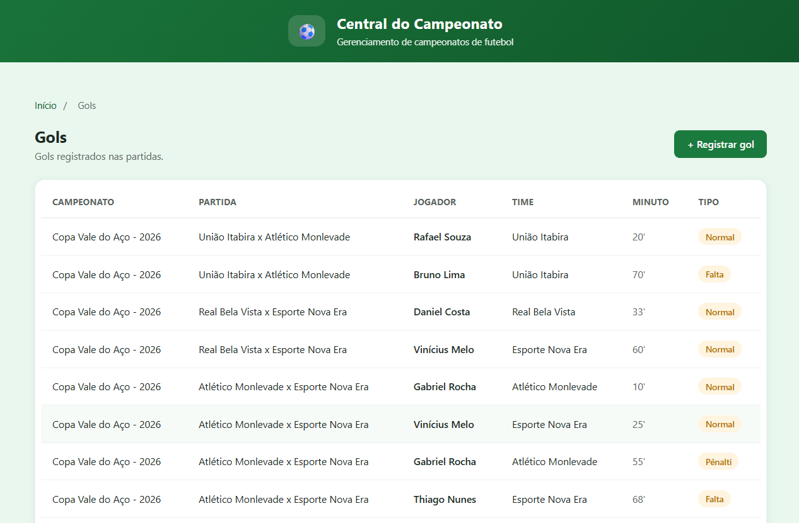

11. Consultas classificação:

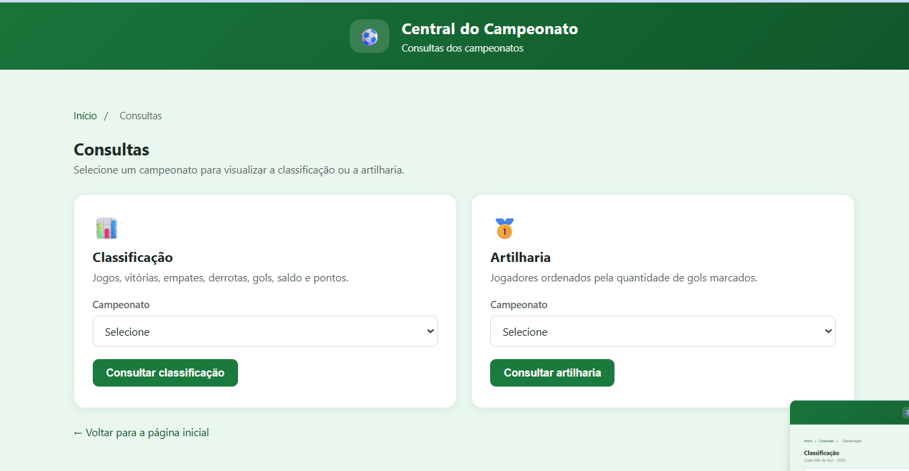
.png)

---

## Autores

Projeto desenvolvido por:

- **Clarissa Cesar Tomaz** — Matrícula: 22.1.8026
- **Eduardo Ferreira Satler** — Matrícula: 19.1.8980

Trabalho desenvolvido para a disciplina de Banco de Dados.
